# Geminton — Technical overview

**Stack:** Flutter (Dart SDK per `pubspec.yaml`)  
**Package name:** `geminton` (see `pubspec.yaml`)

**Audience:** Developers joining the project or implementing features.

---

## 1. Repository layout (high level)

```
lib/
  main.dart                    # App entry, service init, auto-backup kickoff
  main_navigation_scaffold.dart
  navigation_drawer.dart
  screens/                     # All feature screens
  services/                    # Domain-grouped services (see §4)
  models/                      # GemRecord, Certificate, templates, filters, etc.
  widgets/                     # Shared UI (filters, certificate dialog, …)
  theme/                       # app_theme.dart, AGENTS.md (AI context)
  utils/
docs/                          # This folder — functional + technical specs
```

---

## 2. Runtime initialization (`main.dart`)

Typical startup:

- `WidgetsFlutterBinding.ensureInitialized()`
- `GemRecordService.init()` — Hive Flutter + opens box for records
- `ApprovalHistoryService.init()` — Hive adapters for approval history
- `AppEntitlementsService.init()`
- `FileHandlerService.initializeListener()` — file intents when app already running
- Optional: `CloudBackupService.shouldAutoBackup()` → `performAutoBackup()` (not awaited)
- `runApp(MyApp())`

---

## 3. Data & persistence

### 3.1 Gem records

- **Storage:** Hive box `gemRecords`; each value is a **JSON string** (`jsonEncode` / `jsonDecode` of `GemRecord`).
- **Model:** `lib/models/gem_record.dart` — **canonical** shape for saved data; `toJson` / `fromJson` migrations must stay backward compatible when agreed.

### 3.2 Approval history

- **Storage:** Hive **type adapters** with `@HiveType` / `@HiveField` in `lib/models/approval_history.dart`.
- **Constraint:** Never reuse or reorder `@HiveField` indices; add new fields with the next index only.

### 3.3 Other persisted state

- **SharedPreferences:** Field visibility, export visibility, templates, currency rate cache, exhibition metadata, entitlements-related flags, etc. (see respective services).

---

## 4. Services map (`lib/services/`)

| Folder | Responsibility |
|--------|----------------|
| `records/` | `GemRecordService`, `GemDataService`, validation, `ApprovalHistoryService`, **`GemDuplicateService`** (fingerprint hash for dedup) |
| `field_config/` | Visibility, sections, order, custom fields, dropdowns, color grades integration |
| `certificate/` | `GemVisionService`, deterministic extraction v2, OCR, parsing, lab detection |
| `export/` | Label + exhibition export; `label_export_visibility_service`, `exhibition_visibility_service` |
| `import/` | Excel import, exhibition import |
| `backup/` | `CloudBackupService`, Google Drive, media backup, image compression |
| `filters/` | Saved filters, builder, application to queries |
| `messaging/` | `TemplateService`, `MessagingAppService` (open WhatsApp/WeChat) |
| `analytics/` | `AnalyticsSummaryBuilder`, `CurrencyConverterService` (Fawaz API + cache) |
| `ai/` | **Dormant** product AI (`ai_service`, insights services); do not change without explicit product request |

Root-level services (examples): `app_entitlements_service`, `file_handler_service`, `gem_color_grades_service`, `template_service` was moved under messaging — use `messaging/template_service.dart`.

---

## 5. Navigation & routing

- **Drawer-driven** shell: `MainNavigationScaffold` swaps body by index; **Add Gem** uses index `-1` and pushes `AddGemOptionsScreen`.
- **Deep links / file open:** `main.dart` + `FileHandlerService` for sharing files into import flows where implemented.

---

## 6. Flow diagrams (Mermaid)

These diagrams summarize **how control and data move** through the app. They are approximate—check the cited files for edge cases.

**Viewing:** GitHub renders Mermaid in markdown. In VS Code, use a Mermaid preview extension, or paste into [mermaid.live](https://mermaid.live).

### 6.1 Application startup

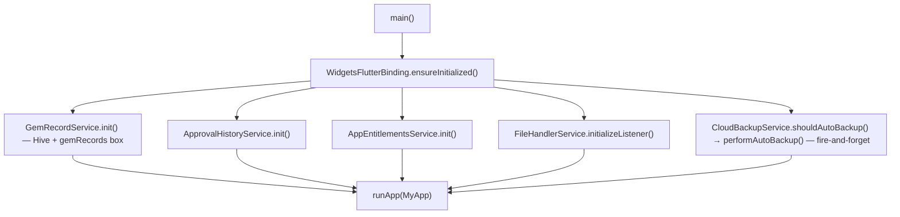

### 6.2 Main shell: drawer → body

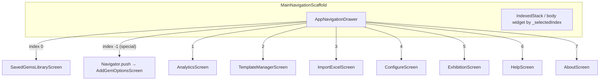

*(Exact indices are defined in `main_navigation_scaffold.dart` / drawer—verify if you add menu items.)*

### 6.3 Add Gem → save record

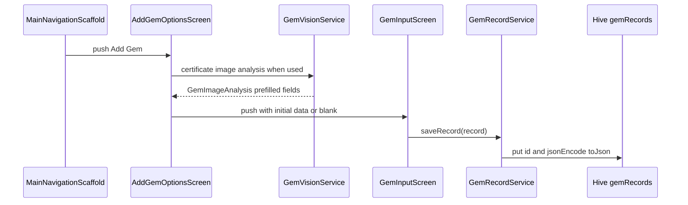

### 6.4 Gem Library: load, filter, open detail

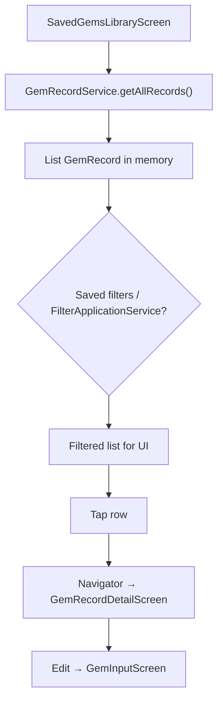

### 6.5 Configure → field visibility on form

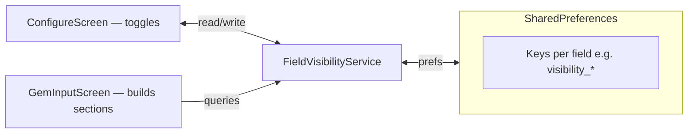

### 6.6 Label export (high level)

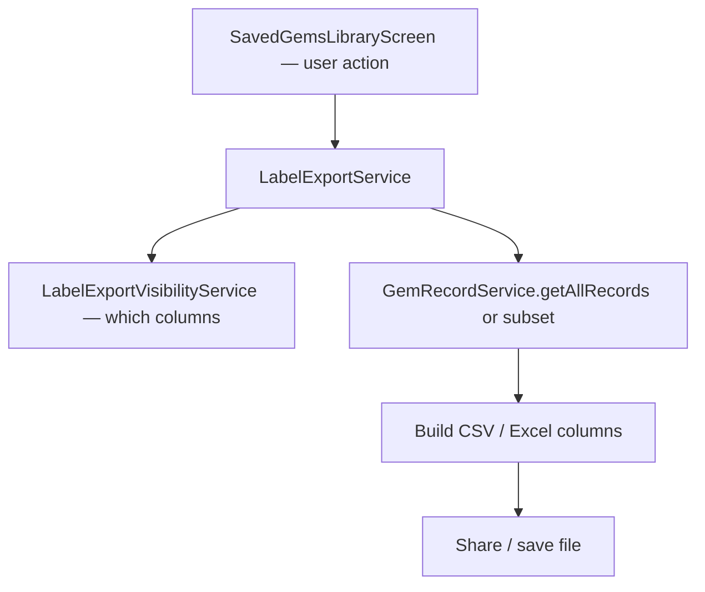

### 6.7 Import: ZIP backup vs standalone Excel

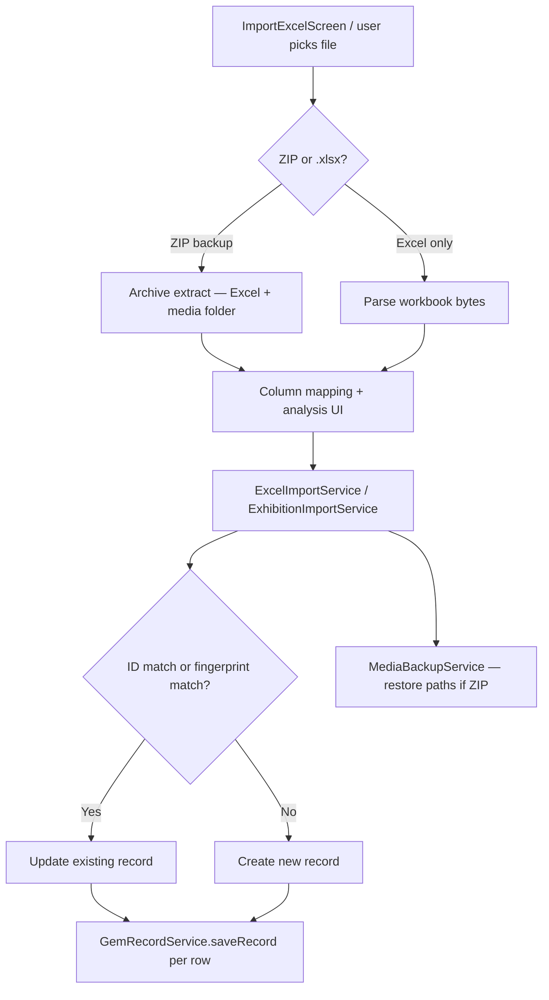

### 6.8 Cloud backup ZIP

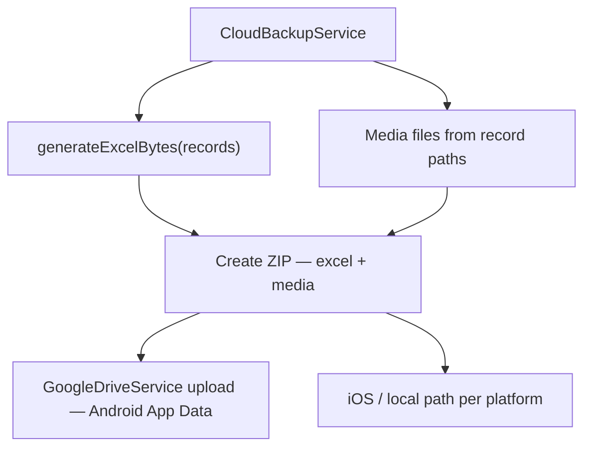

### 6.9 Analytics: currency rates on screen open

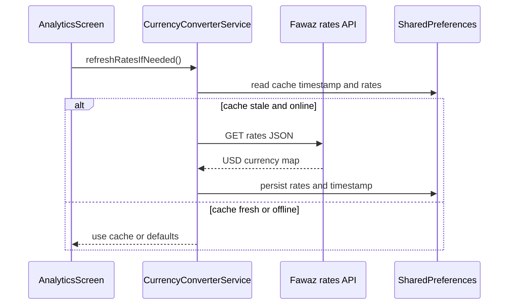

### 6.10 Certificate image analysis (simplified)

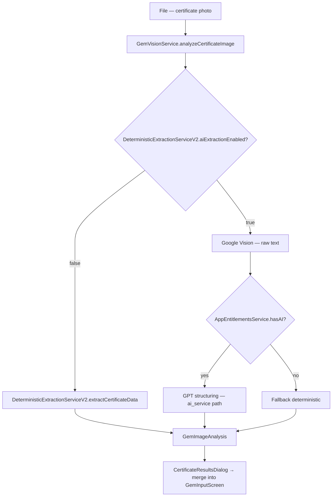

### 6.11 File intent while app running (optional path)

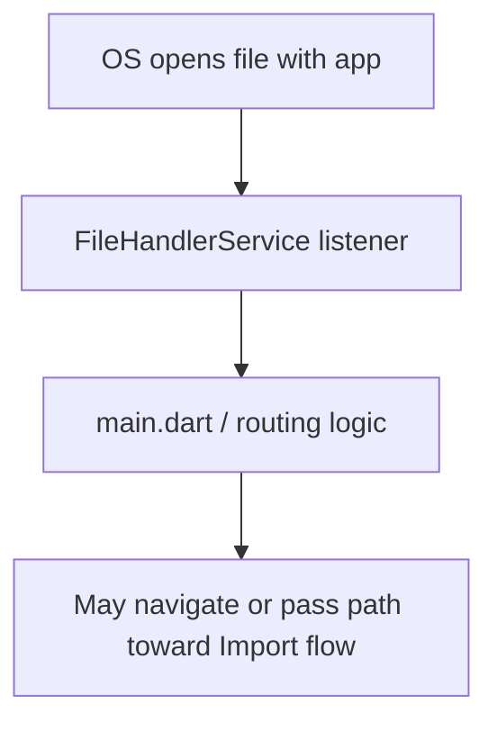

---

## 7. Notable integrations

- **Google Sign-In / Drive:** Backup upload to App Data folder (Android); see `google_drive_service.dart`, `cloud_backup_service.dart`.
- **Currency rates:** HTTP fetch from Fawaz Ahmed CDN / fallback URL; 24h cache in `SharedPreferences` (`CurrencyConverterService`).
- **Certificate images:** File-based; optional Google Vision + GPT path behind flags/entitlements vs **deterministic** extraction (`DeterministicExtractionServiceV2`).

---

## 8. Theming

- `lib/theme/app_theme.dart` — Material 3, `surfaceTintColor: Colors.transparent` where set to avoid default M3 tint on bars.

---

## 9. Key packages (non-exhaustive)

See `pubspec.yaml` for versions: `hive_flutter`, `http`, `excel`, `archive`, `shared_preferences`, `image_picker`, `file_picker`, `share_plus`, `mobile_scanner` (QR), etc.

---

## 10. Build & release

- Standard Flutter: `flutter build apk` / `flutter build appbundle` / iOS equivalents.
- Signing and store listing are outside this doc.

---

## 11. Documentation set

| File | Role |
|------|------|
| [FUNCTIONAL.md](./FUNCTIONAL.md) | Product behavior and flows |
| This file | Architecture and code map |
| [AGENTS.md](../lib/theme/AGENTS.md) | AI agent rules + field checklist + constraints |

---

## 12. Changing system fields

Adding/removing/renaming a **core** `GemRecord` field touches many files. Follow the **checklist table** in `lib/theme/AGENTS.md` (*Core (system) field changes*).

---

*Update this file when architecture, dependencies, persistence, major service boundaries, or key control flows change (including §6 diagrams).*
